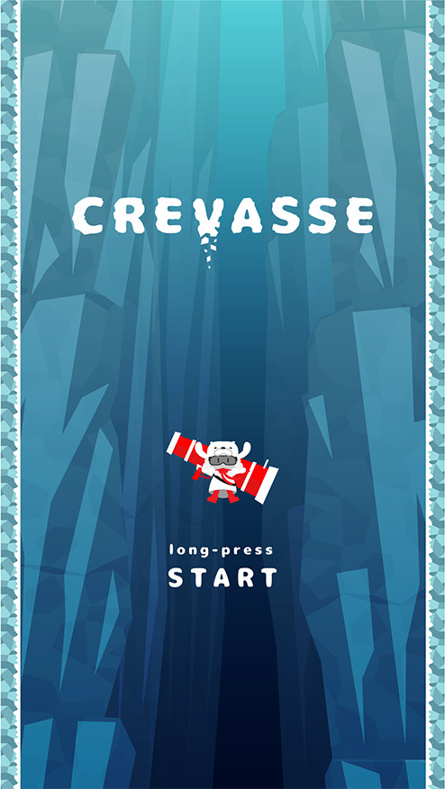

+++
# Date this page was created.
date = 2017-12-19

# Project title.
title = "Crevasse"

# Project summary to display on homepage.
summary = "Falling down action game [`iOS`, `Android`]"

# Optional image to display on homepage (relative to `static/img/` folder).
image_preview = "projects/screenshot_00.jpg"

# Tags: can be used for filtering projects.
# Example: `tags = ["machine-learning", "deep-learning"]`
tags = ["iOS", "Android"]

# Optional external URL for project (replaces project detail page).
external_link = "https://crevasse.jp/"

# Does the project detail page use math formatting?
math = false

# Optional featured image (relative to `static/img/` folder).
[header]
# image = "projects/screenshot_00.jpg"
# caption = "My caption :smile:"

+++

